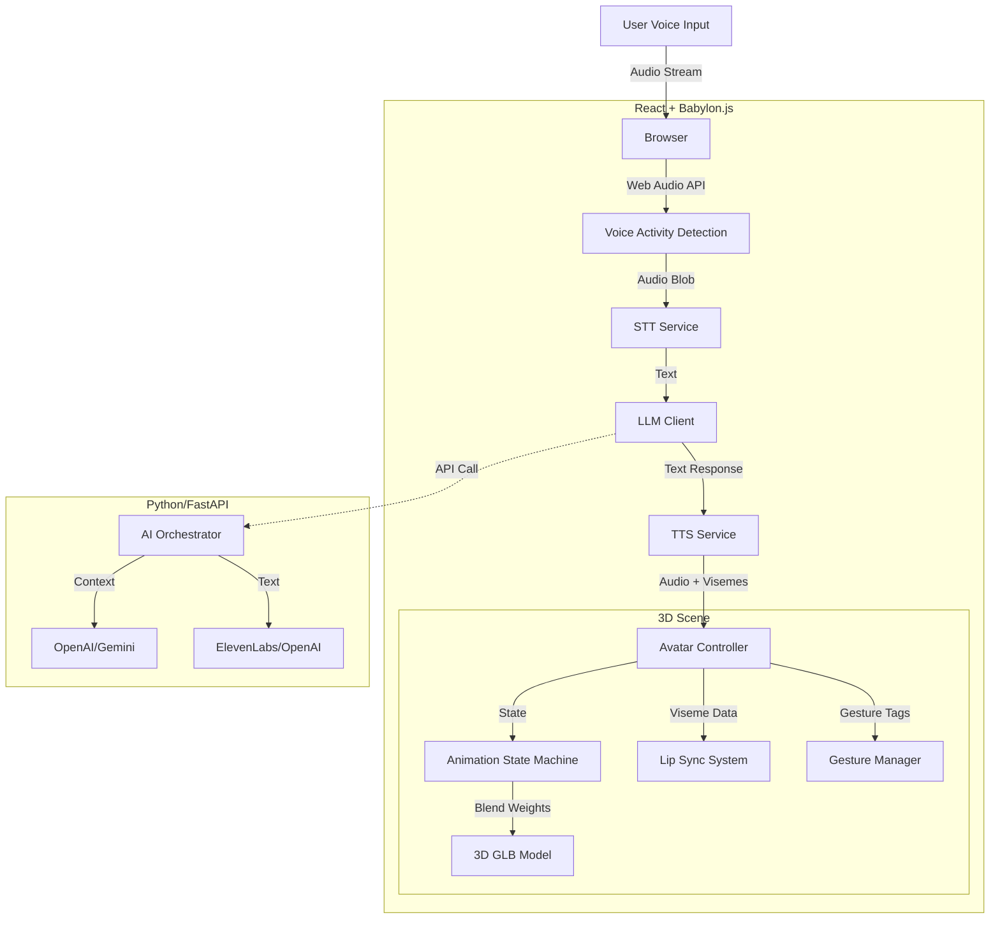

# 3D AI Chatbot Avatar - Technical Design Document

## 1. System Architecture Diagram



## 2. Animation State Machine Logic

The avatar operates on a finite state machine (FSM) to ensure natural behavior transitioning.

### States
- **IDLE**: Default state. Subtle breathing, blinking, slight head sway. Eye tracking enabled (follows camera/mouse).
- **LISTENING**: Triggered when VAD detects speech. Head tilts slightly forward/to side (active listening), expression softens, eyes lock on user.
- **THINKING**: Triggered after STT completes while waiting for LLM. Hand-to-chin or gaze drift (looking up/away slightly), maybe a slow nod.
- **SPEAKING**: Triggered when TTS audio is ready. Lip-sync active. Random emphasis gestures (hands). Head nods on stressed syllables.

### Transitions
- `IDLE` → `LISTENING`: On VAD active. (Blend: 0.5s)
- `LISTENING` → `THINKING`: On VAD silence/commit. (Blend: 0.4s)
- `THINKING` → `SPEAKING`: On TTS stream start. (Blend: 0.3s)
- `SPEAKING` → `IDLE`: On Audio ended. (Blend: 0.5s)

## 3. Babylon.js Implementation Strategy

### Scene Setup (Pseudocode)
```typescript
class AvatarScene {
  engine: Engine;
  scene: Scene;
  avatarMesh: AbstractMesh;
  
  constructor(canvas) {
    this.engine = new Engine(canvas, true);
    this.scene = this.createScene();
  }

  createScene() {
    const scene = new Scene(this.engine);
    // Environment
    const env = CubeTexture.CreateFromPrefilteredData("env.env", scene);
    scene.environmentTexture = env;
    scene.createDefaultSkybox(env, true);
    
    // Lighting for character
    const light = new HemisphericLight("light1", new Vector3(0, 1, 0), scene);
    light.intensity = 0.7;
    
    return scene;
  }

  async loadAvatar() {
    // Load GLB
    const result = await SceneLoader.ImportMeshAsync("", "./assets/", "avatar.glb", this.scene);
    this.avatarMesh = result.meshes[0];
    
    // Setup Animation Groups
    this.setupAnimations(result.animationGroups);
    
    // Setup Lip Sync targets
    this.setupMorphTargets(this.avatarMesh);
  }
}
```

### Animation Control
We will use `AnimationGroup` in Babylon.js and blend weights.

```typescript
function transitionState(fromGroup: AnimationGroup, toGroup: AnimationGroup, duration: number) {
    // Crossfade
    fromGroup.setWeightForAllAnimatables(1);
    toGroup.setWeightForAllAnimatables(0);
    toGroup.play(true);
    
    let time = 0;
    scene.onBeforeRenderObservable.add(() => {
        time += engine.getDeltaTime() / 1000;
        const t = Math.min(time / duration, 1);
        
        // Linear blend
        fromGroup.setWeightForAllAnimatables(1 - t);
        toGroup.setWeightForAllAnimatables(t);
        
        if (t === 1) fromGroup.stop();
    });
}
```

## 4. AI Orchestration Flow

1.  **Speech-to-Text (Frontend/Backend)**:
    *   Capture audio chunks (MediaRecorder).
    *   Send to Whisper API (faster to do via backend proxy to hide keys) or run purely client-side (Web Speech API - faster but less accurate).
    *   *Decision*: Web Speech API for MVP (latency), Whisper for Prod.

2.  **LLM Processing (Backend)**:
    *   Receive text.
    *   Append system prompt: *"You are a helpful assistant. Keep answers concise. Use tags [emote:happy], [gesture:explain] for control."*
    *   Stream response to Frontend.

3.  **Text-to-Speech & Sync (Frontend)**:
    *   Frontend receives sentence buffer.
    *   Send to TTS API (e.g., ElevenLabs via Backend).
    *   Receive Audio Buffer + **Viseme Data** (alignment info).
    *   Play Audio.
    *   Update Morph Targets (mouth shapes) frame-by-frame based on Viseme timestamps.

## 5. Best Practices & Performance

*   **Draco Compression**: Use Draco-compressed GLB files to reduce load time.
*   **Asset Optimization**: Max 20k-40k polygons for mobile support.
*   **Render Loop**: Do not create objects inside the render loop (`scene.registerBeforeRender`). Reuse vectors.
*   **Shadows**: Use `ShadowGenerator` with distinct bias, but disable on mobile if FPS < 30.
*   **Singleton Audio**: Re-use AudioContext.
